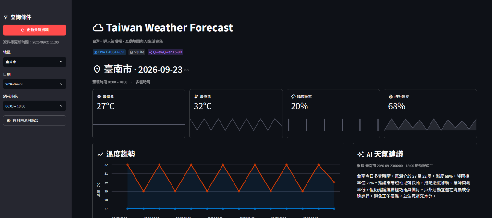

# Taiwan Weather Forecast 台灣天氣預報儀表板

這是一個可直接執行的台灣天氣預報 Dashboard。系統從中央氣象署（CWA）取得即時預報 JSON 資料，經過清理轉換為標準化 Pandas DataFrame 並寫入 SQLite 資料庫持久化，最後以 Streamlit 呈現多維度圖表、互動地圖與 Hugging Face 生成式 AI 天氣生活建議。



---

## 系統架構與資料流 (System Architecture)

系統核心遵循完整的 ETL 與 AI 增強管線。

> 📚 **系統技術設計規格書請參閱：[design.md](design.md)**  
> 📊 **完整流程圖、Mermaid 架構圖、時序圖與資料表設計請參閱：[myplane/workflow.md](myplane/workflow.md)**

```text
CWA Open Data (F-D0047-091)
          ↓ (Part 2: 氣象資料擷取與 JSON 解析)
       cwa_api.py → 標準化 DataFrame
          ↓ (Part 3: SQLite 資料庫持久化與去重)
       database.py ↔ data.db (WeatherForecasts)
          ↓ (Part 4: 前端互動視覺化)
       app.py (Streamlit)
       ├─ KPI 關鍵指標
       ├─ Altair 溫度區間圖
       ├─ Folium 台灣氣象地圖
       └─ (Part 5: Hugging Face AI 智慧生活建議)
          ai_service.py → Qwen/Qwen3.5-9B (Fallback 備援機制)
```

---

## 工作流程總覽 (Workflow Overview)

| 階段 | 核心主題 | 負責模組 / 檔案 | 核心技術與重點職責 |
| :--- | :--- | :--- | :--- |
| **Part 1** | **環境建置與設定** | `requirements.txt`, `.env` | Python 虛擬環境建立、API 金鑰配置與安全隔離 |
| **Part 2** | **氣象資料擷取與解析** | `cwa_api.py` | 串接 CWA REST API、JSON 巢狀解析、容錯對齊輸出 DataFrame |
| **Part 3** | **資料庫持久化與去重** | `database.py`, `data.db` | SQLite 自動建表、複合唯一鍵約束、Upsert 冪等去重寫入 |
| **Part 4** | **互動儀表板與視覺化** | `app.py`, `.streamlit/` | Streamlit 響應式 UI、Altair 區間圖表、Folium 氣溫分佈地圖 |
| **Part 5** | **生成式 AI 生活建議** | `ai_service.py` | 結構化 Prompt、Qwen-9B、多層 Fallback 備援與錯誤隔離 |
| **Part 6** | **系統執行與自動化測試** | `tests/test_pipeline.py` | pytest 單元測試、Mock 離線驗證、端到端 (E2E) 流程走測 |
| **Part 7** | **常見問題與排查** | 常見 FAQ | 401/403 授權失敗、連線逾時、HF 額度不足等故障排除 |

---

## Part 1：環境建置與 API 金鑰設定 (Environment & Configuration)

本專案建議使用 **Python 3.10 ~ 3.12** 環境執行。

### 1.1 建立 Python 虛擬環境與安裝依賴

在專案根目錄開啟 PowerShell，依序執行下列指令建立獨立環境：

```powershell
# 1. 建立虛擬環境
python -m venv .venv

# 2. 啟用虛擬環境 (若遇到腳本限制，先執行 Bypass)
Set-ExecutionPolicy -Scope Process -ExecutionPolicy Bypass
.\.venv\Scripts\Activate.ps1

# 3. 升級 pip 並安裝專案套件
python -m pip install --upgrade pip
pip install -r requirements.txt
```

### 1.2 設定 API 金鑰與環境變數

專案內建 `.env.example` 樣板，複製並建立正式 `.env` 檔案：

```powershell
Copy-Item .env.example .env
```

開啟 `.env` 並填入您的金鑰資訊：

```dotenv
CWA_API_KEY=你的中央氣象署授權碼
HF_TOKEN=你的_Hugging_Face_Token
```

* **CWA_API_KEY**：至 [中央氣象署開放資料平臺](https://opendata.cwa.gov.tw/) 免費註冊會員，於「個人設定」取得 API 授權碼。
* **HF_TOKEN**：至 [Hugging Face Token Settings](https://huggingface.co/settings/tokens) 建立一個具備 Inference Providers 讀取權限的 Token。
* **資安防護規範**：`.env` 與本機資料庫 `data.db` 已嚴格列入 `.gitignore`，請勿將真實 Token 提交至 Git 版本庫。

### 1.3 雲端部署金鑰設定 (Streamlit Community Cloud)

當您將專案部署至 Streamlit Community Cloud 時，由於 `.env` 未被 Git 追蹤，需透過 Streamlit 後台的 **Secrets** 機制注入金鑰：

1. 進入 [Streamlit Community Cloud 儀表板](https://share.streamlit.io/) 並點選您的 App。
2. 點擊右下角或側邊選單中的 **Settings** → 選擇 **Secrets** 分頁。
3. 貼上以下 TOML 格式設定（程式已內建相容 `st.secrets` 讀取機制）：
   ```toml
   CWA_API_KEY = "你的中央氣象署授權碼"
   HF_TOKEN = "你的_Hugging_Face_Token"
   HF_MODEL = "Qwen/Qwen3.5-9B"
   ```
4. 點擊 **Save** 儲存，回到頁面點選「更新天氣資料」即可正常運作。

---

## Part 2：CWA 氣象資料擷取與 JSON 解析 (API Fetching & Parsing)

主要程式模組：[`cwa_api.py`](file:///c:/Users/user/Desktop/local_folder/AIoT_L3_CWA_HW1/cwa_api.py)

### 2.1 資料集來源
串接中央氣象署開放資料平臺資料集 **`F-D0047-091`（全臺縣市一週天氣預報）**：
```text
https://opendata.cwa.gov.tw/api/v1/rest/datastore/F-D0047-091
```

### 2.2 資料處理流程
1. **安全連線與請求**：`fetch_cwa_forecast(api_key)` 發送 HTTP GET 請求，統一設定 `REQUEST_TIMEOUT = 30` 秒，並將網路異常或非 200 回應安全封裝為 `CWAError`。
2. **動態結構解析**：
   - 走訪 `records.locations[].location[]`，依 `elementName` 建立查找字典，避免使用寫死的固定陣列索引。
   - 支援欄位大小寫與多種格式相容（例如 `MaxT` / `MaxTemperature` / `最高溫度`、`Wx` / `Weather` / `天氣現象`、`PoP12h` / `PoP` / `降雨機率`、`RH` / `RelativeHumidity` / `相對濕度`）。
3. **時段精確對齊**：以預報時段（`startTime` 與 `endTime`）為基準，動態配對溫度、天氣現象、降雨機率與濕度。
4. **容錯設計**：若單一地區缺少部分數值（例如離島缺部分降雨機率），欄位填補 `None`，絕不因局部缺漏中斷整批預報的解析。
5. **輸出標準化 DataFrame**，欄位統一規範為：
   `regionName`、`dataDate`、`startTime`、`endTime`、`minTemp`、`maxTemp`、`weather`、`rainProbability`、`humidity`。

---

## Part 3：SQLite 資料庫持久化與去重儲存 (Database & Deduplication)

主要程式模組：[`database.py`](file:///c:/Users/user/Desktop/local_folder/AIoT_L3_CWA_HW1/database.py)

### 3.1 資料庫結構設計
系統自動維護本地資料庫檔案 `data.db`，於首次啟動時自動初始化資料表 `WeatherForecasts`：

```sql
CREATE TABLE IF NOT EXISTS WeatherForecasts (
    id INTEGER PRIMARY KEY AUTOINCREMENT,
    regionName TEXT NOT NULL,
    dataDate TEXT NOT NULL,
    startTime TEXT NOT NULL,
    endTime TEXT NOT NULL,
    minTemp REAL,
    maxTemp REAL,
    weather TEXT,
    rainProbability REAL,
    humidity REAL,
    UNIQUE(regionName, startTime, endTime)
);
```

### 3.2 冪等寫入與去重 (Upsert)
* **唯一性鍵值約束**：以 `(regionName, startTime, endTime)` 建立 `UNIQUE` 約束。
* **Upsert 更新邏輯**：使用 SQLite 原生 `INSERT INTO ... ON CONFLICT(regionName, startTime, endTime) DO UPDATE SET ...` 語法。多次點擊「更新天氣資料」只會更新最新氣象數據，保證不產生重覆資料紀錄。
* **安全性防護**：所有查詢一律採用 Parameterized Query（如 `WHERE regionName = ?`），嚴禁字串拼接 SQL，防止潛在 SQL Injection 風險。

---

## Part 4：Streamlit 互動儀表板與視覺化呈現 (Interactive Dashboard)

主要程式模組：[`app.py`](file:///c:/Users/user/Desktop/local_folder/AIoT_L3_CWA_HW1/app.py)

### 4.1 儀表板執行方式
```powershell
# 方式 A：先啟用虛擬環境（最推薦，終端機提示符前方會出現 (.venv)）
Set-ExecutionPolicy -Scope Process -ExecutionPolicy Bypass
.\.venv\Scripts\Activate.ps1
streamlit run app.py

# 方式 B：直接呼叫虛擬環境 Python 執行（無需先手動 Activate）
.\.venv\Scripts\python.exe -m streamlit run app.py
```

### 4.2 核心視覺化與互動功能
* **側邊欄互動篩選 (Sidebar Filters)**：
  - 支援快速下拉選擇「台灣 22 個縣市」。
  - 動態連動「預報日期」與「預報時段（日/夜）」。
  - 「更新天氣資料」按鈕：一鍵發送請求至 CWA API，解析並即時寫入 SQLite。
* **KPI 關鍵指標卡片**：
  - 清楚展示當前選定时段的「最低溫」、「最高溫」、「降雨機率」與「相對濕度」。
* **Altair 溫度區間趨勢圖 (Temperature Band Chart)**：
  - 以折線圖標示每日最高溫與最低溫走勢。
  - 使用半透明區間帶（`mark_area`）呈現溫差變化，提供直觀的冷暖趨勢。
* **Folium 互動式氣象地圖 (Interactive Map)**：
  - 於台灣地圖上標示各縣市座標位置。
  - Marker 顏色依據平均氣溫動態呈現（藍色 < 20°C、綠色 20~25°C、橘色 25~30°C、紅色 > 30°C）。
  - 點擊 Marker 即可彈出詳細天氣現象、氣溫與降雨機率 Tooltip。
* **原生主題配置**：遵循 `.streamlit/config.toml` 設定，界面美觀清爽，不使用脆弱的客製化 CSS。

---

## Part 5：Hugging Face AI 智慧天氣與生活建議 (GenAI Insights & Fallback)

主要程式模組：[`ai_service.py`](file:///c:/Users/user/Desktop/local_folder/AIoT_L3_CWA_HW1/ai_service.py)

### 5.1 提示詞工程 (Prompt Engineering)
系統將所選縣市、氣溫、降雨機率、濕度與天氣現象，組裝成結構化繁體中文 Prompt，約束 LLM：
1. 依序輸出：**天氣摘要**、**穿著建議**、**是否攜帶雨具**、**戶外活動注意事項**。
2. 嚴格基於提供數據，不自行臆測無根據數字。
3. 繁體中文回答，篇幅精準控制在 100～200 字。

### 5.2 模型呼叫與多層級 Fallback 容錯機制
透過官方 `huggingface_hub.InferenceClient` 呼叫推論服務：
* **預設模型**：`Qwen/Qwen3.5-9B`（程式自動停用思考模式 `thinking`，節省推理額度並提升回應速度）。
* **三階段備援模型 (Fallback Chain)**：若預設模型遇上 Provider 負載過高、額度限制或暫不可用，系統自動依序嘗試備援：
  1. `Qwen/Qwen3.5-9B`
  2. `openai/gpt-oss-20b`
  3. `google/gemma-3-27b-it`
* **故障隔離原則**：AI 呼叫設有獨立例外捕捉。若外部 AI 服務逾時或 Token 額度耗盡，前端僅安全提示「AI 天氣建議目前無法取得」，儀表板、地圖與圖表等其餘功能完全正常運作。

---

## Part 6：系統啟動、自動化測試與驗證 (Testing & Quality Assurance)

### 6.1 執行自動化測試
專案包含完整的測試套件，涵蓋資料解析、資料庫持久化、UI 元件生成與 AI 備援機制。

執行離線單元測試（無需外部 API Key）：

```powershell
python -m pytest -q
```

### 6.2 測試涵蓋項目
* **CWA JSON 容錯解析**：驗證欄位順序錯置、大小寫變異、新型態與縮寫欄位能否正確解析。
* **SQLite 寫入與去重驗證**：驗證連續兩次寫入相同預報時，資料庫筆數維持不變（Upsert 驗證）。
* **UI 元件渲染測試**：驗證 Altair 溫度區間圖 Layer 結構與 Folium 地圖標記渲染正確性。
* **AI Prompt 與 Mock 測試**：驗證 Prompt 規範、InferenceClient 呼叫格式與模型 Fallback 順序。

### 6.3 端到端 (E2E) 人工驗證檢查清單
1. 啟動 Streamlit：`streamlit run app.py`。
2. 點擊「更新天氣資料」，確認綠色成功通知與資料筆數提示。
3. 切換左側「地區」與「日期」，確認右側 KPI 卡片、趨勢圖與資料表隨之聯動更新。
4. 滾動至地圖區域，確認縣市 Marker 顯示正常，且顏色與氣溫對應無誤。
5. 檢查下方「AI 天氣建議」區塊是否順利生成 100~200 字的繁體中文生活指南。
6. 暫時清空 `.env` 中的 `HF_TOKEN`，重整確認其他天氣圖表依然正常運作。

---

## Part 7：常見問題與除錯指南 (Troubleshooting & FAQ)

* **Q1: 畫面提示「找不到有效的 CWA_API_KEY」？**
  * 請確認專案根目錄下已建立檔名為 `.env` 的檔案（非 `.env.example`）。
  * 確認金鑰名稱為 `CWA_API_KEY`，且前後無多餘引號或空格。修改後請重啟 Streamlit。
* **Q2: 呼叫氣象 API 遇到 HTTP 401 或 403 錯誤？**
  * 代表中央氣象署授權碼無效或尚未啟用，請登入 CWA 開放資料平臺重新確認授權碼狀態。
* **Q3: 首次開啟網頁顯示「目前資料庫內尚無預報資料」？**
  * 首次執行時 `data.db` 為空，請確認已設定好 `.env`，並於側邊欄點選「更新天氣資料」按鈕。
* **Q4: AI 建議區塊顯示「AI 天氣建議目前無法取得」？**
  * 檢查 `HF_TOKEN` 是否已設定並具備 Inference 權限。
  * 某些開源模型可能因 Hugging Face 伺服器忙碌中或免費額度受限，系統會自動切換至備援模型；您亦可在 `.env` 中指定 `HF_MODEL=其他模型`。
* **Q5: PowerShell 執行時出現腳本存取被拒錯誤？**
  * 請在 PowerShell 視窗執行 `Set-ExecutionPolicy -Scope Process -ExecutionPolicy Bypass` 後再啟用虛擬環境。
* **Q6: 執行時出現「無法辨識 'streamlit' 詞彙」？**
  * 代表當前終端機尚未啟用虛擬環境，系統 PATH 找不到套件執行檔。
  * 請先執行 `.\.venv\Scripts\Activate.ps1` 啟用虛擬環境，或直接改用 `.\.venv\Scripts\python.exe -m streamlit run app.py` 啟動。
* **Q7: 部署到 Streamlit Community Cloud 上收不到 API Key？**
  * 因 `.env` 受到 `.gitignore` 保護未上傳至 GitHub，雲端執行時請至 Streamlit Cloud 管理後台點擊 **Settings → Secrets**。
  * 貼上 `CWA_API_KEY = "..."` 與 `HF_TOKEN = "..."` 後儲存即可。程式已內建自動由 `st.secrets` 讀取金鑰。
