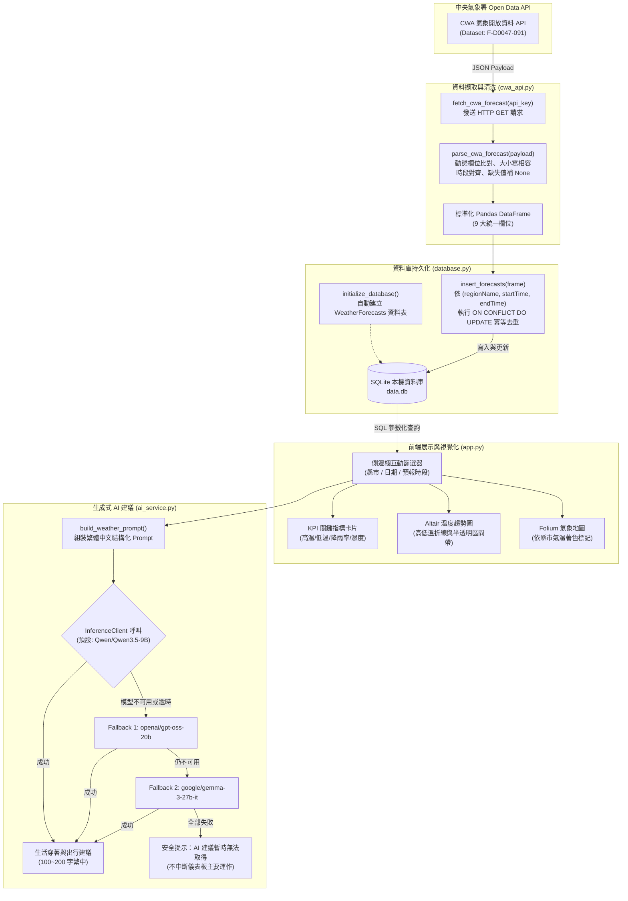
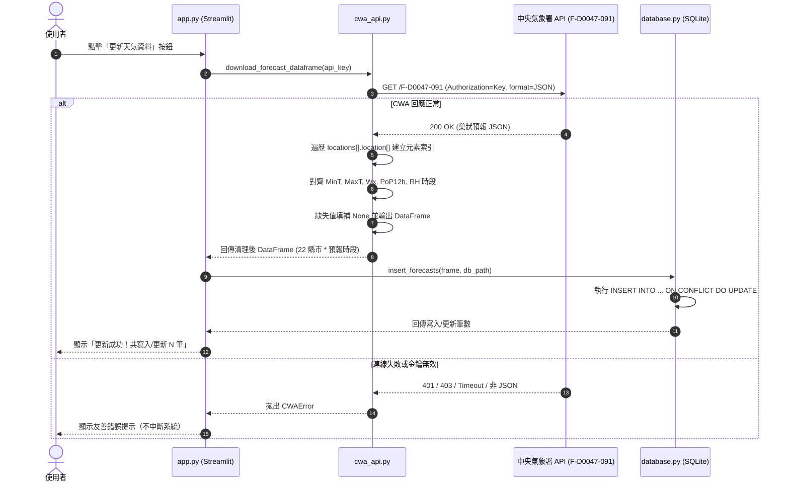
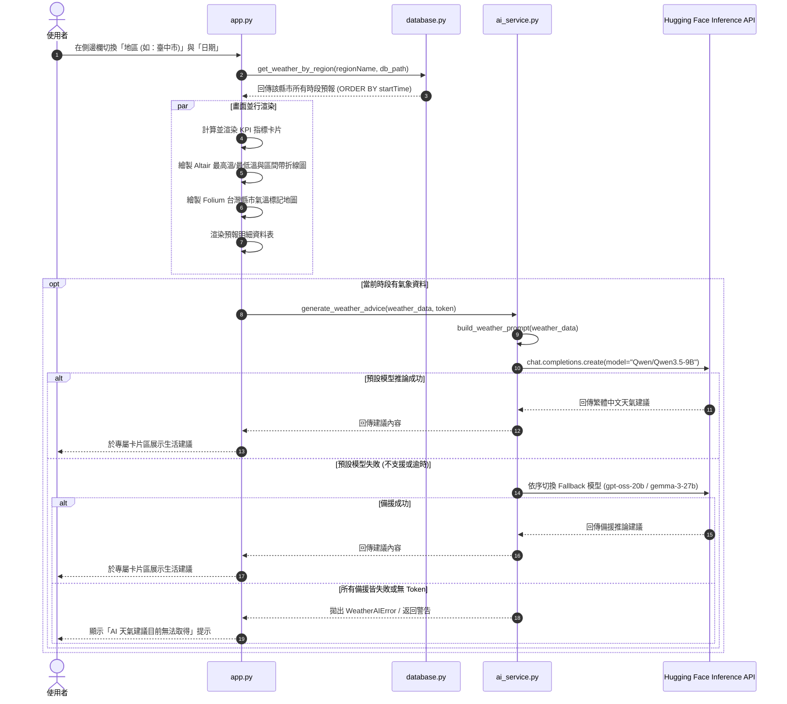

# Taiwan Weather Forecast 系統架構與工作流程圖 (System Workflow)

本文件詳細展示 Taiwan Weather Forecast Dashboard 的系統架構、資料處理管線（ETL）、模組互動時序與各階段的核心工作流程。

> 📚 **系統技術設計規格書請參閱：[../design.md](../design.md)**  
> 📖 **快速上手指南與流程總覽請參閱：[../README.md](../README.md)**

---

## 1. 總體系統架構圖 (Architecture Overview)

### 1.1 系統管線階層文字圖

```text
┌─────────────────────────────────────────────────────────────────┐
│ Part 2: CWA 氣象資料擷取與 JSON 解析 (cwa_api.py)                 │
│ 中央氣象署開放資料 API (Dataset: F-D0047-091 一週預報)             │
│      ↓ HTTP GET (JSON 格式)                                     │
│ 欄位對齊、缺失值容錯、大小寫相容 → 標準化 Pandas DataFrame         │
└───────────────────────────────┬─────────────────────────────────┘
                                ↓
┌───────────────────────────────┴─────────────────────────────────┐
│ Part 3: SQLite 資料庫持久化與去重 (database.py)                  │
│ 自動初始化 data.db / WeatherForecasts 資料表                    │
│ 依 (regionName, startTime, endTime) 唯一約束                    │
│ 執行 Upsert 冪等更新 (ON CONFLICT ... DO UPDATE)                │
└───────────────────────────────┬─────────────────────────────────┘
                                ↓
┌───────────────────────────────┴─────────────────────────────────┐
│ Part 4: Streamlit 互動儀表板與視覺化 (app.py)                   │
│ ├─ 側邊欄篩選：全台縣市、預報日期、日夜時段切換                  │
│ ├─ KPI 關鍵指標：最高溫、最低溫、降雨機率、相對濕度              │
│ ├─ Altair 趨勢圖：溫度區間帶 (Band) 與高低溫折線                │
│ └─ Folium 地圖：各縣市平均溫度顏色標記 (藍/綠/橘/紅)             │
└───────────────────────────────┬─────────────────────────────────┘
                                ↓
┌───────────────────────────────┴─────────────────────────────────┐
│ Part 5: Hugging Face AI 智慧天氣建議 (ai_service.py)            │
│ 結構化 Prompt 模板工程 → 呼叫 InferenceClient                   │
│ 預設模型 Qwen/Qwen3.5-9B (關閉 thinking 節省 token)             │
│ 支援 3 階段 Fallback 備援 (gpt-oss-20b / gemma-3-27b)           │
│ 輸出：穿著建議、雨具提示、戶外活動指南 (繁體中文 100~200 字)     │
└─────────────────────────────────────────────────────────────────┘
```

---

### 1.2 系統架構 Mermaid 流程圖



---

## 2. 核心工作流程詳細分解

### 2.1 資料擷取與清理流程 (ETL Flow)



---

### 2.2 儀表板互動與 AI 生活建議時序流程 (User Interaction & AI Flow)



---

## 3. 資料庫 Schema 與資料表關聯

本專案採用輕量級本機資料庫 `data.db`，核心預報表 `WeatherForecasts` 的設計如下：

| 欄位名稱 | 型態 | 限制條件 | 說明 |
| :--- | :--- | :--- | :--- |
| `id` | INTEGER | PRIMARY KEY AUTOINCREMENT | 主鍵自動遞增流水號 |
| `regionName` | TEXT | NOT NULL | 縣市名稱（如：臺中市、新北市） |
| `dataDate` | TEXT | NOT NULL | 預報日期（格式：YYYY-MM-DD） |
| `startTime` | TEXT | NOT NULL | 預報時段起始時間 |
| `endTime` | TEXT | NOT NULL | 預報時段結束時間 |
| `minTemp` | REAL | 可為 NULL | 預報最低溫度 (°C) |
| `maxTemp` | REAL | 可為 NULL | 預報最高溫度 (°C) |
| `weather` | TEXT | 可為 NULL | 天氣現象描述（如：多雲短暫雨） |
| `rainProbability` | REAL | 可為 NULL | 降雨機率 (%) |
| `humidity` | REAL | 可為 NULL | 相對濕度 (%) |

> **唯一性鍵值 (Composite Unique Key)**：
> `UNIQUE(regionName, startTime, endTime)` 保證同一縣市在相同時間區間內只有一筆紀錄，重複下載時執行 Upsert 更新，不造成資料膨脹。

---

## 4. 模組職責對照表

| 模組檔案 | 核心函式 / 元件 | 工作流程職責 |
| :--- | :--- | :--- |
| **`config.py`** | `BASE_DIR`, `CWA_API_KEY`, `HF_TOKEN`, `HF_FALLBACK_MODELS` | 集中環境變數管理，載入 `.env` 與全域配置參數 |
| **`cwa_api.py`** | `fetch_cwa_forecast()`, `parse_cwa_forecast()`, `download_forecast_dataframe()` | 呼叫 CWA API、JSON 格式與大小寫相容、時段對齊、輸出 Pandas DataFrame |
| **`database.py`** | `initialize_database()`, `insert_forecasts()`, `get_weather_by_region()`, `get_regions()` | SQLite 資料庫初始化、Upsert 冪等寫入與防重、參數化安全查詢 |
| **`ai_service.py`** | `build_weather_prompt()`, `generate_weather_advice()` | 提示詞組裝、Hugging Face InferenceClient 連線、3 階段 Fallback 容錯 |
| **`app.py`** | `make_temperature_chart()`, `make_weather_map()`, `main()` | Streamlit 側邊欄篩選、KPI 呈現、Altair 區間圖表、Folium 地圖整合 |
| **`tests/test_pipeline.py`** | `test_parse_expected_fields()`, `test_sqlite_insert_query_and_dedup()`, `test_hugging_face_falls_back_when_model_is_not_supported()` | 離線自動化單元測試，驗證解析、去重、圖表與 AI Fallback 正確性 |
